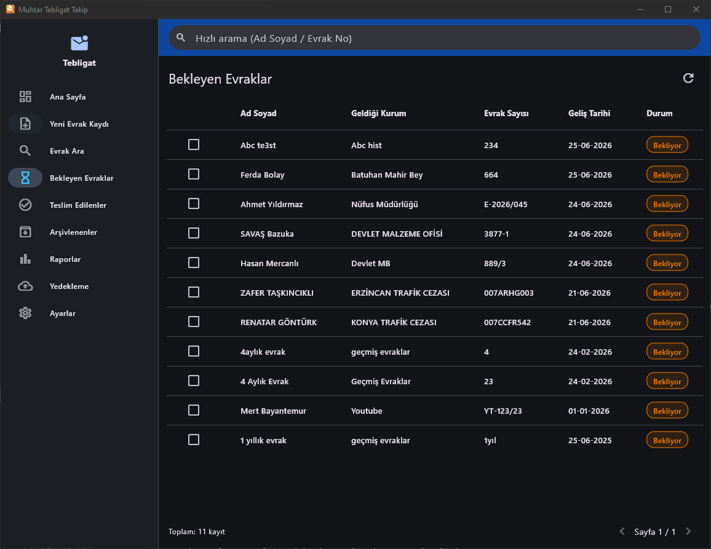
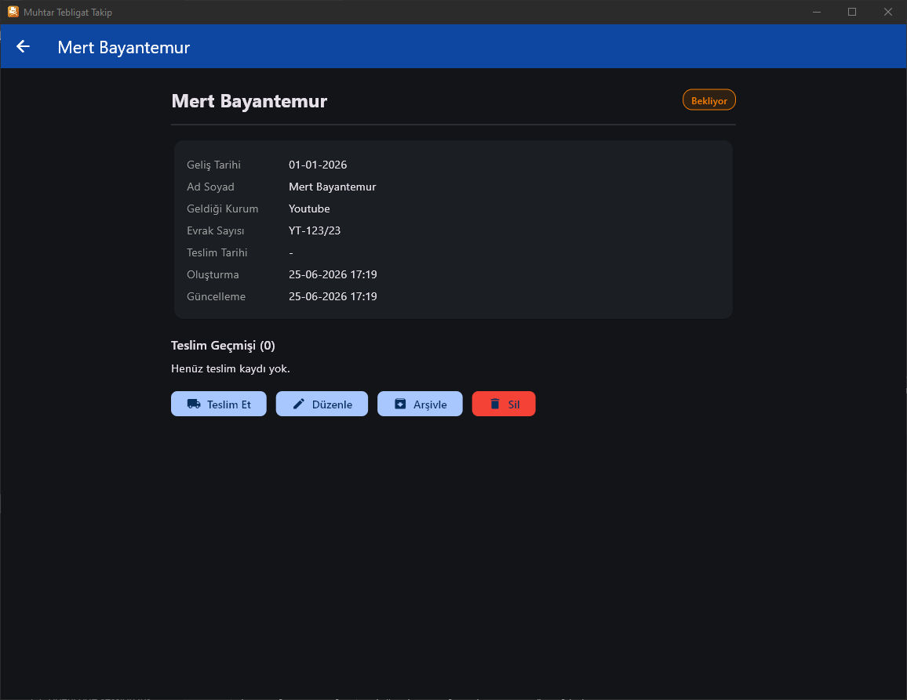
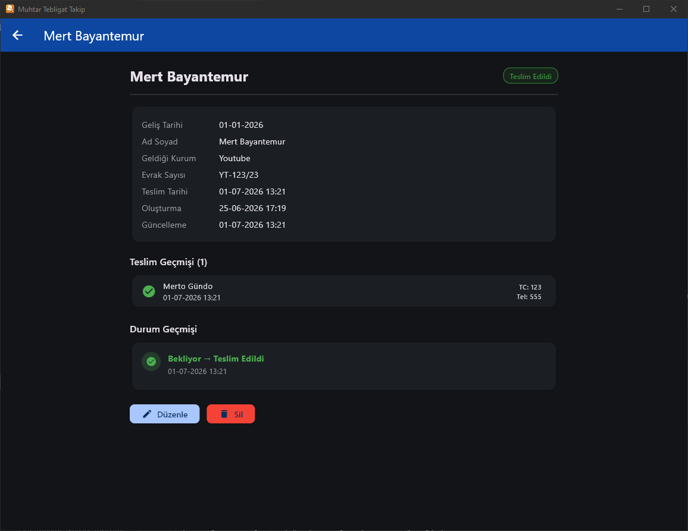

<p align="center">
  
</p>

<h1 align="center">Muhtarlık Tebligat Takip Sistemi</h1>

<p align="center">
  Windows ortamında çalışan, modern, hızlı ve sade bir <strong>muhtarlık tebligat takip</strong> uygulaması.<br>
  Flutter Desktop + SQLite ile geliştirilmiştir. Sunucu gerektirmez.
</p>

<p align="center">
  <a href="https://github.com/stan0ne/muhtar-tebligat-takip/releases/latest">
    
  </a>
  <a href="https://github.com/stan0ne/muhtar-tebligat-takip/releases">
    
  </a>
</p>

---

## Önizleme

<p align="center">
  <a href="dashboard.png"></a>
</p>

<table>
  <tr>
    <td align="center"><b>Bekleyen Evraklar</b></td>
    <td align="center"><b>Evrak Detayı</b></td>
    <td align="center"><b>Teslim Edilenler</b></td>
  </tr>
  <tr>
    <td><a href="dashboard2.png"></a></td>
    <td><a href="dashboard3.png"></a></td>
    <td><a href="dashboard4.png"></a></td>
  </tr>
</table>

---

## Özellikler

| Kategori | Detay |
|---|---|
| **Evrak Yönetimi** | Ekleme, düzenleme, silme, durum değiştirme (Bekliyor → Teslim Edildi / Arşivlendi) |
| **Arama** | Ad Soyad, Evrak Sayısı, Geldiği Kurum, Teslim Alan, TC Kimlik No, Telefon, tarih aralığı filtresi + canlı arama |
| **Toplu İşlem** | Çoklu seçim ile toplu teslim etme |
| **Durum Geçmişi** | Her evrak için zaman çizelgesi görünümünde durum değişiklik kayıtları |
| **Raporlar** | Günlük / Aylık / Yıllık / Tarih Aralığı + Excel ve PDF çıktıları |
| **Yedekleme** | Dahili yedekleme (otomatik günlük) + harici dizine yedekleme + geri yükleme |
| **İçe/Dışa Aktarma** | Excel'den toplu kayıt aktarma + veritabanını dışa aktarma |
| **Otomatik Arşivleme** | Ayarlanabilir ay eşiğine göre otomatik arşivleme |
| **Log Sistemi** | Tüm işlemlerin kaydı (ekleme, teslim, silme, yedekleme vb.) |
| **Tema** | Açık / Koyu / Sistem temalı |
| **Dil** | Türkçe arayüz, UTF-8, Türkçe karakter duyarlı arama |

---

## Kurulum

### Installer ile (önerilen)

[En son sürümden](https://github.com/stan0ne/muhtar-tebligat-takip/releases/latest) uygun formatı indirin:

| Format | Açıklama |
|---|---|
| **EXE** (`_setup_.exe`) | Inno Setup ile hazırlanmış kurulum. `C:\Program Files`'a kurulur, masaüstü kısayolu oluşturur. |
| **MSI** (`_setup_.msi`) | Windows Installer paketi. Grup ilkesi ile toplu dağıtım için uygundur. |

### MSIX ile
```bash
dart run msix:create
```
Modern Windows paketleme formatı. Program Ekle/Kaldır'da temiz görünür.

### Geliştirme ortamı
```bash
flutter pub get
flutter run -d windows
```

### Release derleme
```bash
flutter build windows --release
```
Çıktı: `build\windows\x64\runner\Release\muhtar_tebligat_takip.exe`

Dağıtım için `Release` klasörünün tamamı gereklidir (EXE + DLL + data).

---

## Gereksinimler

- Flutter 3.44+ (stable)
- Windows 10/11 (64-bit)
- Geliştirici Modu açık olmalı: `ms-settings:developers`

---

## Teknoloji

| Katman | Teknoloji |
|---|---|
| UI | Flutter 3.44 / Dart |
| Veritabanı | SQLite (sqflite_common_ffi) |
| Durum Yönetimi | Provider |
| Raporlar | syncfusion_flutter_xlsio (Excel), pdf (PDF) |
| Kurulum | Inno Setup (EXE), WiX (MSI) |
| CI/CD | GitHub Actions (otomatik build + release) |

---

## Mimari

Katmanlı mimari + Repository Pattern. Detaylı bilgi: [ARCHITECTURE.md](./ARCHITECTURE.md)

```
lib/
├── core/              # Sabitler, tarih yardımcıları
├── data/
│   ├── database/      # SQLite yöneticisi, şema, migrasyon
│   ├── models/        # Evrak, TeslimKaydi, DurumGecmisi, LogEntry
│   └── repositories/  # Repository Pattern
├── services/          # İş katmanı (Evrak, Backup, Export, Import, Log, Settings)
└── ui/
    ├── pages/         # Tüm ekranlar + widget'lar
    ├── providers/     # Provider ile durum yönetimi
    ├── shell/         # Ana menü iskeleti (NavigationRail)
    ├── theme/         # Açık/koyu tema
    └── widgets/       # Ortak UI yardımcıları
```

---

## Veritabanı

SQLite — tek `tebligat.db` dosyası, `%APPDATA%\MuhtarTebligat\` altında.

**Tablolar:** `Evraklar`, `TeslimKayitlari`, `DurumGecmisleri`, `Loglar`, `Ayarlar`

Detaylı şema: [ARCHITECTURE.md](./ARCHITECTURE.md#veritabanı-şeması)

---

## Sürüm Geçmişi

Değişiklikler için [CHANGELOG.md](./CHANGELOG.md) dosyasına bakın.

---

## Lisans

Bu proje açık kaynaklıdır. Detaylı bilgi için [LICENSE](./LICENSE) dosyasına bakın.
