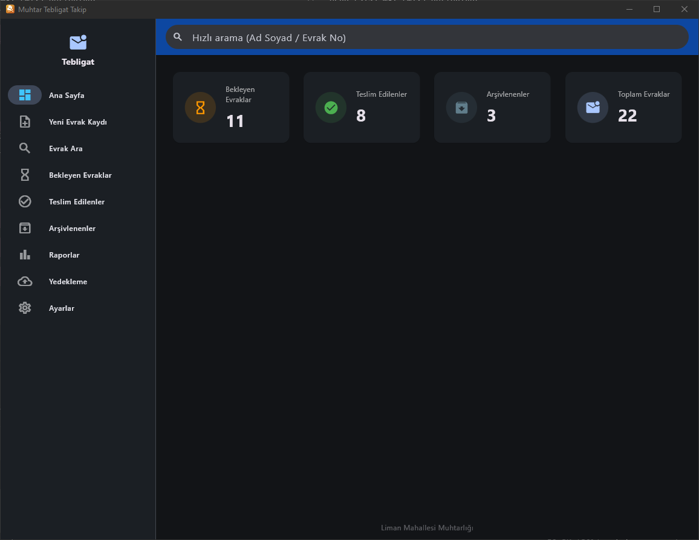

<p align="center">
  
</p>

<h1 align="center">Muhtarlık Tebligat Takip Sistemi</h1>

<p align="center">
  Windows ortamında çalışan, modern, hızlı ve sade bir <strong>muhtarlık tebligat takip</strong> uygulaması.<br>
  Flutter Desktop + SQLite ile geliştirilmiştir. Sunucu gerektirmez, tek EXE olarak dağıtılabilir.
</p>

## Özellikler

- **Evrak kaydı**: geliş tarihi, ad soyad, geldiği kurum, evrak sayısı (otomatik "Bekliyor" durumu)
- **Canlı arama**: ad soyad / evrak no / kurum / teslim alan / telefon / TC kimlik no filtreleri (debounce'lu)
- **Durum yönetimi**: Bekliyor → Teslim Edildi / Arşivlendi, arşivden geri alma
- **Toplu teslim**: çoklu seçim ile birden fazla evrakı tek seferde teslim etme
- **Teslim işlemi**: teslim alan, T.C. kimlik, telefon, açıklama → otomatik teslim kaydı + tarih
- **Durum geçmişi**: her evrakın durum değişiklik geçmişi (zaman çizelgesi)
- **Arşivleme**: manuel arşiv / geri al, otomatik arşivleme (ayarlanabilir ay eşiği)
- **Raporlar**: günlük/aylık/yıllık/tarih aralığı + **Excel** ve **PDF** çıktıları
- **Yedekleme**: dahili + harici (dizin seçimi) + bulut yedekleme (Google Drive / OneDrive skeleton)
- **Excel içe aktarma**: boş şablon indirme, dosya seçimi → önizleme → veritabanına aktarma
- **Log sistemi**: tüm işlemler (ekleme, güncelleme, teslim, arşivleme, silme, yedekleme, içe aktarma)
- **Yumuşak silme**: kayıtlar fiziksel silinmez (`silindi_mi`, `silinme_tarihi`)
- **Tema**: açık / koyu / sistem
- **Performans**: indeksler + sayfalama (50/sayfa) → 500.000+ kayıt hedefi
- **Türkçe arayüz**, UTF-8 desteği, Türkçe karakter duyarlı arama (REPLACE zincirleri)
- **Responsive dashboard**: kartlar ekran boyutuna göre orantılı ölçeklenir
- **ESC desteği**: tüm uygulamada ESC tuşu ile geri dönme
- **Pencere boyutu**: 1170×900 px
- **Tarih formatı**: DD-MM-YYYY (görüntüleme), YYYY-MM-DD (veritabanı)
- **Kurulum**: MSIX (modern Windows paketleme, Microsoft Store desteği)

## Önizleme

<p align="center">
  
</p>

## Kurulum & Çalıştırma

### Gereksinimler
- Flutter 3.44+ (stable)
- Windows 10/11
- **Geliştirici Modu** açık olmalı (plugin symlink için): `ms-settings:developers`

### Geliştirme
```bash
flutter pub get
flutter run -d windows
```

### Release derleme (tek EXE + DLL)
```bash
flutter build windows --release
```
Çıktı: `build\windows\x64\runner\Release\muhtar_tebligat_takip.exe`

Dağıtım için `Release` klasörünün tamamı (EXE + DLL + data) kopyalanır.

### MSIX paketi oluşturma
```bash
dart run msix:create
```
Çıktı: `build\windows\x64\runner\Release\muhtar_tebligat_takip.msix`

MSIX, Windows'un modern paketleme formatıdır. Kurulum temizdir, Program Ekle/Kaldır'da görünür, otomatik güncelleme destekler.

## Mimari

Katmanlı mimari + Repository Pattern. Ayrıntılar: [ARCHITECTURE.md](./ARCHITECTURE.md)

```
lib/
├── core/              # Sabitler, tarih yardımcıları
├── data/
│   ├── database/      # SQLite yöneticisi, şema, migrasyon, indeksler
│   ├── models/        # Evrak, TeslimKaydi, DurumGecmisi, LogEntry
│   └── repositories/  # Repository Pattern (Evrak/Teslim/DurumGecmisi/Log)
├── services/          # İş katmanı: Evrak, Backup, CloudBackup, Export, Import, Log, Settings
└── ui/
    ├── pages/         # Tüm ekranlar + widget'lar
    ├── providers/     # Provider ile durum yönetimi
    ├── shell/         # Ana menü iskeleti
    ├── theme/         # Açık/koyu tema
    └── widgets/       # Ortak UI yardımcıları
```

## Veritabanı

SQLite (tek `tebligat.db` dosyası, `ApplicationSupportDirectory` altında).

**Tablolar:** `Evraklar`, `TeslimKayitlari`, `DurumGecmisleri`, `Loglar`, `Ayarlar`

Detaylı şema ve indeksler: [ARCHITECTURE.md](./ARCHITECTURE.md#veritabanı-şeması)

## Dokümanlar

- [CHANGELOG.md](./CHANGELOG.md) — sürüm değişiklikleri
- [ARCHITECTURE.md](./ARCHITECTURE.md) — mimari ve teknik tasarım
